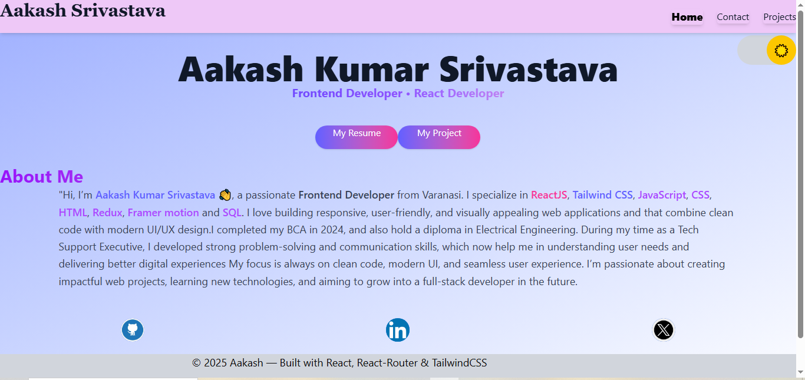
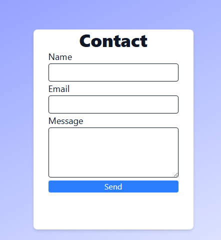
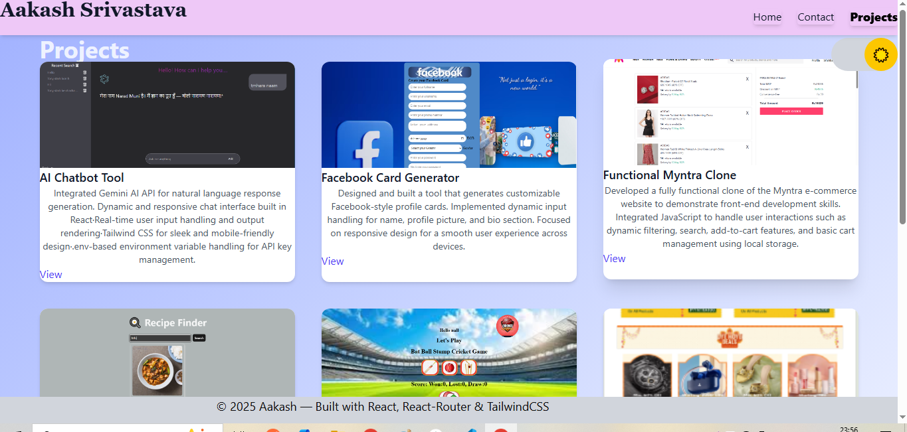
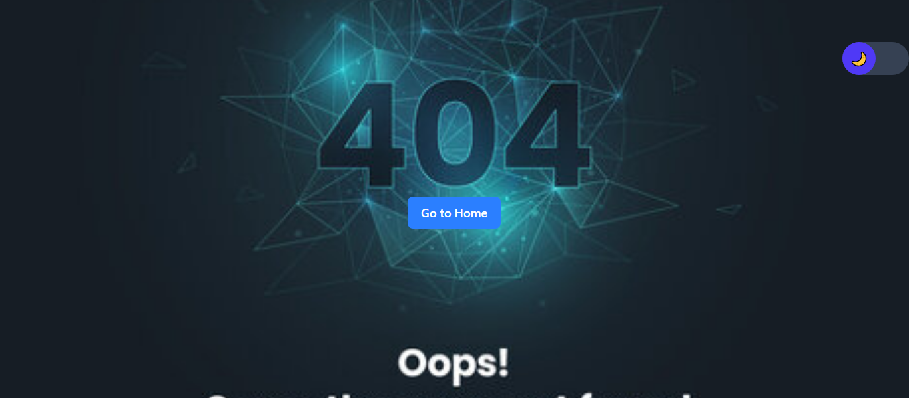
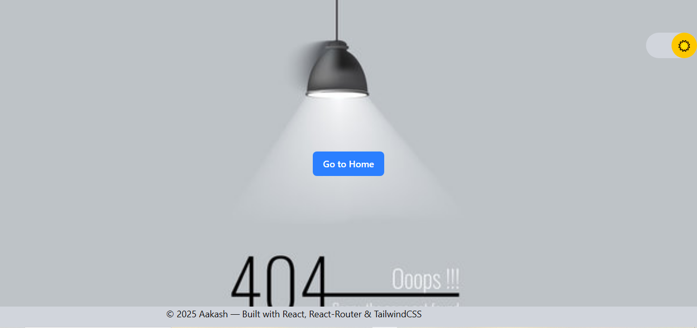

# Portfolio Website

A modern and responsive Portfolio Website built with React.js, styled using Tailwind CSS, animated with Framer Motion, and powered by React Router for smooth navigation.

## 🚀 Features

🔹 React + React Router v7 for SPA navigation

🎨 Tailwind CSS for responsive and modern UI design

✨ Framer Motion for smooth animations (scroll + transitions)

🌗 Dark/Light Mode with localStorage persistence

📂 Projects Section powered by JSON data

📱 Responsive Design (Desktop + Mobile with hamburger menu)

📨 Contact Form with validation (Name, Email, Message)

📸 Preview

🛠️ Tech Stack

⚛️ React.js – Component-based frontend library

🎨 Tailwind CSS – Utility-first CSS framework

🎬 Framer Motion – Animation library for React

🔀 React Router DOM – Client-side routing

🗂️ JSON Data – For dynamic projects listing

📂 Folder Structure
src/
├─ components/
│ ├─ NavBar.jsx
│ ├─ Home.jsx
│ ├─ Projects.jsx
│ ├─ Contact.jsx
│ └─ ProjectCard.jsx
├─ data/
│ └─ projects.json
├─ App.jsx
├─ index.css
└─ index.jsx

# ⚡ Installation

Clone this repository

git clone https://github.com/yourusername/portfolio.git
cd portfolio

Install dependencies

npm install

Run development server

npm run dev

Build for production

npm run build

# 📌 Pages

Home → Hero Section, About Intro

Projects → Grid of projects with image, title, description, link

Contact → Form with validation (Name, Email, Message)

Dark/Light Mode → Toggle with persistence

## 📸 Screenshots

Example:  

# 🎬 Animations

Smooth page transitions using Framer Motion

Scroll-based animations (fade-in, slide, zoom)

Button and card hover effects

# 🌗 Dark/Light Mode

Implemented with useState + useEffect

Mode persists in localStorage

Toggle available in Navbar (desktop + mobile)

# 📧 Contact

👤 Aakash Kumar Srivastava

💼 LinkedIn

💻 GitHub

⭐ If you like this project, don’t forget to star the repo!

## 🤝 Contributing

Pull requests are welcome. For major changes, please open an issue first  
to discuss what you would like to change.

## 📄 License  
This project is licensed under the MIT License - see the [LICENSE](LICENSE) file for details.

## 🚀 Future Improvements  
- Add Blog Section  
- Add Dark/Light mode animation transition  
- Improve SEO (Meta tags, Open Graph, etc.)  
- Deploy with CI/CD pipeline  

